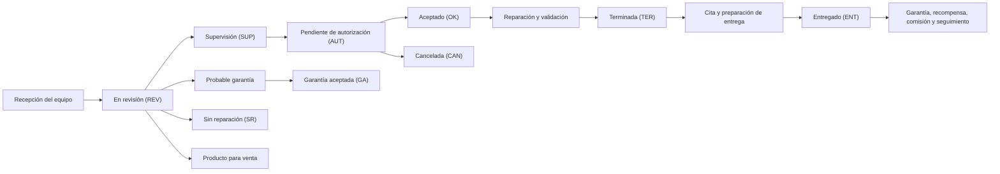

# Operación de órdenes de servicio de EGS

## Propósito

La orden de servicio es el expediente operativo central de EGS. Acompaña al equipo desde su recepción hasta la entrega o cierre y concentra, en un mismo punto de control:

- La identificación del cliente y del equipo.
- La asignación del asesor y de los técnicos.
- El estado actual del servicio.
- La evidencia fotográfica de recepción y seguimiento.
- El diagnóstico, las partidas de servicio y sus importes.
- Los costos internos de la operación.
- Las observaciones internas.
- Los reportes que sí puede consultar el cliente.
- La comunicación, las citas y los comentarios del cliente.
- El pedido de productos o refacciones relacionado.
- La entrega, el ticket, la garantía y el seguimiento posterior.
- Las recompensas y comisiones derivadas de una orden entregada.
- La trazabilidad de cambios, responsables y fechas.

Este documento describe exclusivamente la operación y el diseño utilizado para ejecutarla. No aborda herramientas, componentes técnicos ni la organización interna de la solución.

---

## 1. Participantes

### Administrador

Es el responsable operativo con mayor capacidad de decisión. Puede consultar las órdenes de su empresa, registrar y modificar datos, reasignar responsables, cambiar cualquier estado, administrar partidas e inversiones, aplicar recompensas al cierre, imprimir identificaciones, eliminar órdenes y revisar comisiones, atrasos y trazabilidad.

### Asesor o vendedor

Es el enlace comercial con el cliente. Da seguimiento al presupuesto, comunica cambios relevantes, registra o consulta citas, acompaña la autorización y puede avanzar la orden por las etapas comerciales permitidas. Consulta el detalle económico y participa en el seguimiento, mientras administración conserva el control de inversiones y de las reasignaciones completas.

### Técnico

Recibe o conserva la posesión operativa del equipo, documenta hallazgos, añade observaciones y reportes de estado, y participa en los cambios propios del trabajo técnico. Puede llevar una orden de revisión a supervisión y una orden aceptada a terminada. También puede indicar tipos especiales de reparación, como recarga de cartucho o servicio externo.

### Secretaría

Apoya en la consulta, coordinación y seguimiento administrativo. Puede revisar los datos del cliente, fechas, responsables, estados, observaciones, reportes y citas, pero la información comercial y las asignaciones principales se presentan como consulta.

### Segundo técnico

Puede registrarse como participante sin sustituir al técnico que tiene la posesión del equipo. Sus partidas quedan identificadas de forma separada. Cuando intervienen dos técnicos, la comisión técnica queda marcada para revisión antes de considerarse confirmada.

### Superadministración

Dispone de visibilidad global del listado de órdenes para supervisión general entre empresas.

### Cliente

Consulta sus equipos, estados, importes visibles, reportes, historial, recompensas y entrega. También puede enviar comentarios, solicitar ayuda y registrar su decisión sobre el aviso de privacidad.

---

## 2. Expediente operativo de la orden

Cada orden reúne los siguientes grupos de información.

### Identificación

- Número único de orden.
- Título generado a partir del cliente y del equipo.
- Empresa responsable.
- Fecha y hora de ingreso.
- Fecha de última modificación.
- Fecha y hora de salida cuando se entrega.

### Cliente

- Nombre.
- Correo, teléfono y WhatsApp cuando están disponibles.
- Historial de órdenes.
- Calificación operativa.
- Probabilidad histórica de cancelación.
- Tiempo promedio de recolección.
- Saldo de recompensas.

### Equipo

- Marca.
- Modelo.
- Últimos seis caracteres del número de serie.
- Fotografías de recepción.
- Imagen principal o portada cuando existe.
- Etiqueta física de identificación.

### Responsables

- Asesor.
- Técnico que tiene la posesión.
- Segundo técnico participante, cuando aplica.

### Información comercial

- Hasta diez partidas base.
- Partidas adicionales.
- Partidas del segundo técnico.
- Recargas de cartucho.
- Precio por partida.
- Total del servicio.
- Inversiones y costo total interno, visibles para administración.
- Pedido relacionado y su estado.

### Seguimiento

- Estado vigente.
- Historial de cambios de estado.
- Historial de traspasos de técnico.
- Observaciones internas.
- Reportes visibles para el cliente.
- Comentarios enviados por el cliente.
- Citas relacionadas.

---

## 3. Flujo operativo principal

El diagrama representa el recorrido operativo esperado. Administración puede mover una orden directamente al estado que corresponda cuando la situación real lo requiera.

### 3.1 Recepción

Al recibir el equipo se:

1. Selecciona al cliente.
2. Asigna técnico y asesor.
3. Registra marca, modelo y los últimos seis caracteres del número de serie.
4. Toma evidencia fotográfica del estado de recepción.
5. Registra observaciones internas relevantes.
6. Añade las partidas iniciales, si ya se conocen.
7. Define el estado de entrada, normalmente **En revisión**.

La captura muestra primero a los clientes registrados recientemente y agrega indicadores de su historial para apoyar la atención. El título de la orden se forma automáticamente al completar cliente y equipo.

La evidencia inicial admite hasta diez fotografías. La orden distingue esta evidencia general de las fotografías que después acompañan observaciones o reportes.

### 3.2 Identificación física

Cuando la orden entra en revisión se genera una tarea para que administración imprima una etiqueta de identificación. La etiqueta contiene:

- Número de orden.
- Cliente.
- Equipo y número de serie.
- Datos de contacto de EGS.
- Código de consulta.

Su objetivo es conservar la correspondencia física entre el equipo y su expediente durante todo el servicio.

### 3.3 Revisión y diagnóstico

El técnico inspecciona el equipo y documenta:

- Condiciones de ingreso.
- Fallas encontradas.
- Pruebas realizadas.
- Daños o riesgos.
- Servicios y refacciones propuestas.
- Evidencia adicional.

Existen dos canales de documentación:

1. **Observaciones y detalles internos.** Sirven para coordinación entre el personal. No se muestran al cliente.
2. **Reporte de estado del equipo.** Se redacta para el cliente y puede incluir hasta ocho fotografías. Debe ser claro, profesional y no contener notas internas.

Cada observación adicional conserva autor, perfil, fecha y, opcionalmente, una fotografía.

### 3.4 Supervisión

La supervisión representa la revisión de calidad del diagnóstico o del trabajo técnico antes de presentar la propuesta al cliente. Permite validar que:

- La falla esté correctamente identificada.
- Las partidas sean comprensibles.
- Los importes correspondan al trabajo.
- La evidencia sea suficiente.
- El equipo esté asignado al responsable correcto.

### 3.5 Presupuesto y autorización

Cuando el diagnóstico y las partidas están listos, la orden pasa a **Pendiente de autorización**. El asesor contacta al cliente para explicar el presupuesto.

La comunicación se adapta al estado:

- En revisión: bienvenida y confirmación de recepción.
- Pendiente de autorización: aviso de que el presupuesto está listo.
- Aceptado: confirmación del monto autorizado.
- Terminada: aviso de equipo listo y solicitud de confirmar cita.
- Entregado: mensaje de seguimiento y satisfacción.

El acceso al portal del cliente puede compartirse en cualquier momento.

En la vista pública, los conceptos y precios se muestran cuando la orden está **Aceptada**, **Terminada**, **Entregada** o **Sin reparación**. Durante revisión, supervisión y espera de autorización, el cliente ve el avance, pero no el desglose económico.

### 3.6 Aceptación y ejecución

Cuando el cliente autoriza, la orden pasa a **Aceptado**. A partir de este punto se ejecuta el servicio acordado.

Durante la ejecución se puede:

- Actualizar partidas y precios.
- Agregar nuevas partidas.
- Registrar inversiones.
- Incorporar un segundo técnico.
- Añadir partidas específicas del segundo técnico.
- Registrar una recarga de cartucho.
- Relacionar un pedido de producto o refacción.
- Cambiar al técnico que conserva la posesión.
- Añadir observaciones internas.
- Publicar reportes de avance para el cliente.

Todo cambio de estado o traspaso de técnico queda registrado con fecha y responsable.

### 3.7 Terminación

La orden pasa a **Terminada** cuando el trabajo concluyó y el equipo está listo para entrega.

En esta etapa:

- Se notifica al cliente que el equipo está listo.
- Se puede enviar un segundo mensaje para confirmar la recolección.
- Se agenda una cita directamente desde la orden.
- Se preparan el cobro, el ticket y la documentación de salida.
- Se mantiene seguimiento sobre equipos no recogidos.

### 3.8 Entrega

Al cambiar la orden a **Entregado**:

- Se registra automáticamente la fecha y hora de salida.
- El estado queda presentado como cierre de la orden.
- Se muestra la fecha de entrega.
- Se puede aplicar saldo de recompensas, limitado por el saldo disponible y el total del servicio.
- Se genera el comprobante final.
- Se habilita la etiqueta de garantía.
- La orden participa en el cálculo de recompensas y comisiones.
- Se activa el seguimiento posterior de satisfacción.

El comprobante presenta número de orden, cliente, equipo, serie, partidas, precios, total, asesor, técnico, espacio de firma, condiciones del servicio y acceso al portal del cliente.

---

## 4. Estados de la orden

| Estado | Significado operativo | Acción esperada |
|---|---|---|
| En revisión (REV) | El equipo fue recibido y está siendo diagnosticado. | Identificar, inspeccionar y documentar. |
| Supervisión (SUP) | El diagnóstico o trabajo requiere validación de calidad. | Revisar hallazgos, partidas y evidencia. |
| Pendiente de autorización (AUT) | El presupuesto está preparado y se espera respuesta. | Contactar al cliente y explicar el alcance. |
| Aceptado (OK) | El cliente autorizó el servicio. | Ejecutar las partidas aprobadas. |
| Terminada (TER) | El servicio concluyó y el equipo está listo. | Avisar, agendar y preparar entrega. |
| Entregado (ENT) | El equipo salió y la operación quedó cerrada. | Emitir documentos, garantía y seguimiento. |
| Cancelada (CAN) | El servicio no continuará por decisión operativa o del cliente. | Documentar el motivo y preparar devolución. |
| Sin reparación (SR) | La orden se cierra sin ejecutar una reparación. | Documentar la conclusión y devolver el equipo. |
| En revisión probable garantía | Se evalúa si la incidencia corresponde a un servicio anterior. | Revisar cobertura, evidencia y antecedente. |
| Garantía aceptada (GA) | La atención fue reconocida como garantía. | Ejecutar y documentar el trabajo de garantía. |
| Producto para venta | El equipo deja el flujo normal de reparación y se destina a venta. | Preparar su control comercial y de resguardo. |

### Transiciones por perfil

- El técnico puede avanzar de **En revisión** a **Supervisión** y de **Aceptado** a **Terminada**.
- El asesor puede acompañar el flujo **Revisión → Supervisión → Autorización → Aceptado → Terminada**.
- Administración puede seleccionar cualquiera de los estados operativos.
- Una orden entregada se presenta como cerrada y ya no ofrece un selector normal de estado.

---

## 5. Operaciones que convergen en la orden

### 5.1 Cliente e historial

La orden toma al cliente como referencia común para:

- Datos de contacto.
- Historial de equipos y servicios.
- Órdenes activas y cerradas.
- Probabilidad de cancelación.
- Calificación de entrega.
- Tiempo promedio de recolección.
- Recompensas disponibles.
- Comentarios y solicitudes de ayuda.
- Aceptación del aviso de privacidad.

Los indicadores se usan para orientar la atención según el perfil:

- Administración recibe alertas de cancelación, almacenaje y fidelización.
- El asesor recibe recomendaciones de seguimiento y explicación comercial.
- El técnico recibe recomendaciones de prioridad y nivel de documentación.
- Secretaría recibe recomendaciones sobre recordatorios y preparación de entrega.

### 5.2 Evidencia y comunicación

La operación separa cuatro tipos de contenido:

| Contenido | Quién lo genera | Quién lo consulta | Uso |
|---|---|---|---|
| Fotografías de recepción | Personal de EGS | Personal de EGS | Evidencia de ingreso e identificación. |
| Observaciones internas | Personal de EGS | Personal de EGS | Coordinación, diagnóstico y notas de operación. |
| Reportes del equipo | Personal de EGS | Personal de EGS y cliente | Informar daños, condiciones, hallazgos y avances. |
| Comentarios del cliente | Cliente | Personal de EGS y cliente | Dudas, aclaraciones y retroalimentación por orden. |

Esta separación evita exponer notas internas y permite construir una comunicación pública más clara.

### 5.3 Notificaciones y trazabilidad

La orden alimenta un historial cronológico con:

- Alta de la orden.
- Cambios de estado.
- Traspasos de técnico.
- Observaciones.
- Reportes del equipo.
- Comentarios del cliente.
- Entrega.

Las notificaciones se ajustan al ámbito de cada persona: empresa, asesor o técnico asignado.

También se identifican órdenes activas con más de cinco días desde su ingreso, excluyendo entregadas, canceladas, sin reparación y destinadas a venta. Estas órdenes se presentan como atrasos para promover su seguimiento.

### 5.4 Citas

Desde el detalle de una orden se puede abrir una cita con el número de orden ya definido. La cita reúne:

- Título.
- Orden o pedido relacionado.
- Descripción.
- Fecha.
- Hora.

Los horarios de atención utilizados son:

- Lunes a viernes: 10:00 a 14:00 y 16:00 a 18:30, en intervalos de 30 minutos.
- Sábado: 09:00 a 14:30, en intervalos de 30 minutos.
- Domingo: sin horarios de atención.

La agenda evita ocupar la misma hora y advierte cuando ya existe una cita para la misma orden en el mismo día. Desde la cita se puede volver al expediente y consultar cliente, equipo, estado, total y fecha de ingreso.

### 5.5 Pedidos

Una orden puede relacionarse con un pedido de productos o refacciones. El pedido conserva sus propios conceptos, cantidades, precios, pagos, adeudo y estado.

Los estados operativos del pedido son:

- Pedido pendiente.
- Pedido adquirido.
- Producto en almacén.
- Entregado al asesor.
- Entregado/pagado.
- Entregado/crédito.
- Cancelado.

El estado del pedido puede consultarse y actualizarse desde el contexto de la orden por los perfiles autorizados.

### 5.6 Recompensas

Las órdenes entregadas generan dinero electrónico para el cliente. La regla vigente es una recompensa fija del **1 %** sobre el importe aplicable de la operación.

El saldo:

- Considera las operaciones vigentes de los últimos seis meses.
- Vence seis meses después de generarse.
- Puede aplicarse como descuento al entregar una orden.
- No puede exceder el saldo disponible ni el total del servicio.
- Se muestra al cliente con historial de acumulaciones y canjes.

Si se utiliza saldo, el comprobante separa subtotal, descuento aplicado y total final pagado.

### 5.7 Comisiones

Solo las órdenes entregadas entran al cálculo de comisiones. El total, la inversión, el departamento del técnico y los responsables de la orden determinan el resultado.

Reglas operativas vigentes:

- Electrónica e impresoras: `(Total − Inversión) ÷ 1.16 × 20 %`.
- Sistemas: `Total ÷ 1.16 × 4 %`, sin descontar inversión en órdenes.
- Asesor: `(Total ÷ 1.16 − Inversión) × 4 %`.

Las comisiones se presentan por primera y segunda quincena. Cuando participan dos técnicos, la comisión técnica se separa como **Necesita revisión** y no se incorpora al total confirmado hasta definir la distribución. La comisión del asesor no se detiene por esta causa.

### 5.8 Garantía

La garantía se relaciona con una orden entregada. Su etiqueta incluye:

- Orden.
- Técnico.
- Cliente.
- Equipo.
- Número de serie.
- Fecha de entrega.
- Fecha de vencimiento.
- Código de validación.
- Advertencia de sello alterado.

Al consultar el código, se informa si la cobertura:

- Aún no inicia.
- Está vigente.
- Vence el día de la consulta.
- Está vencida.
- No pudo identificarse.

Antes de la entrega, la etiqueta de ingreso solo identifica el equipo y comunica que la garantía se activará al entregar.

### 5.9 Reportes operativos

La orden es la fuente de los reportes de:

- Órdenes ingresadas.
- Órdenes por rango de fechas.
- Órdenes por estado.
- Órdenes entregadas.
- Órdenes terminadas.
- Órdenes pendientes de autorización.
- Órdenes en supervisión.
- Órdenes en revisión.
- Equipos destinados a venta.
- Marcas, modelos y números de serie.
- Ingresos, inversión y utilidad.
- Comisiones de técnicos y asesores.

---

## 6. Portal del cliente

El cliente accede mediante el código incluido en su documentación. El acceso es personal y reúne todas sus órdenes, no solamente la que originó el código.

### Equipos

Muestra las órdenes activas y permite abrir el detalle de cada equipo. El detalle presenta:

- Estado explicado en lenguaje sencillo.
- Número de orden.
- Cotización cuando el estado permite verla.
- Reportes del equipo y fotografías.
- Resumen del equipo.
- Fecha de ingreso.
- Estado y fecha de entrega.
- Historial de comentarios.

### Monedero

Presenta:

- Saldo disponible.
- Órdenes entregadas.
- Porcentaje de recompensa vigente.
- Movimientos de acumulación y canje.
- Vigencia de seis meses.

### Historial

Reúne las órdenes activas y cerradas, ordenadas de la más reciente a la más antigua.

### Ayuda

Ofrece contacto por WhatsApp, llamada y correo. El cliente puede enviar una solicitud general o relacionarla con una orden. Después consulta el estado de atención y las respuestas de EGS.

### Privacidad

Permite leer el aviso, aceptar o rechazar el tratamiento de datos y registrar la firma cuando se acepta. Mientras no exista una decisión, el portal mantiene un recordatorio visible.

### Retroalimentación

En el detalle de la orden, el cliente puede dejar comentarios. También se presenta una invitación para calificar su experiencia.

---

## 7. Diseño utilizado

### 7.1 Concepto visual

El diseño sigue un lenguaje de operación tipo CRM: fondos claros, superficies blancas, bordes suaves, jerarquía por tarjetas y un color de acento índigo. La intención es que mucha información pueda revisarse sin perder la ubicación de la orden ni su estado.

La paleta base es:

| Uso | Color |
|---|---|
| Fondo general | Gris azulado muy claro `#f8fafc` |
| Superficies | Blanco `#ffffff` |
| Texto principal | Azul pizarra oscuro `#0f172a` |
| Texto secundario | Pizarra `#475569` |
| Texto auxiliar | Gris azulado `#94a3b8` |
| Bordes | Gris claro `#e2e8f0` |
| Acción principal | Índigo `#6366f1` |

Las tarjetas usan esquinas redondeadas de aproximadamente 10 a 14 píxeles, sombras discretas y separación amplia entre bloques. Los encabezados internos combinan icono, nombre de sección y, cuando aplica, un indicador de visibilidad.

### 7.2 Jerarquía de la operación interna

El listado de órdenes utiliza:

- Encabezado oscuro en degradado.
- Título y subtítulo de contexto.
- Acción principal **Agregar orden**.
- Bloque destacado para la última entrega.
- Tabla compacta con búsqueda, ordenamiento y paginación.
- Número de orden como enlace visual prioritario.
- Estado en forma de insignia.
- Acciones por icono para abrir, eliminar, imprimir o etiquetar.
- Desplazamiento horizontal en pantallas estrechas.

La tabla muestra número, técnico, asesor, cliente, total o imagen según el perfil, estado, fechas de entrada, modificación y salida, además de las acciones permitidas.

### 7.3 Diseño del detalle de la orden

El detalle utiliza una composición por tarjetas:

1. **Datos del cliente y análisis** a la izquierda.
2. **Galería y ficha técnica** a la derecha.
3. **Partidas y costos** en una zona amplia.
4. **Asignación y estado** en una zona lateral.
5. **Pedido, comentarios, reportes y observaciones** a todo lo ancho.

La galería presenta imagen principal, contador, miniaturas, navegación y ampliación. La ampliación permite avanzar, retroceder, acercar, alejar y desplazar la imagen.

Los importes se agrupan en barras destacadas:

- Total en verde.
- Inversión en ámbar.
- Monedero en azul.

Los campos que el perfil no puede modificar se conservan visibles como lectura, evitando ocultar el contexto.

### 7.4 Formularios

El registro de una orden se presenta en un cuadro amplio dividido en:

- Asignación.
- Datos del equipo.
- Evidencia fotográfica.
- Detalles internos.
- Partidas y total.

Los campos obligatorios se señalan de forma visible. La marca se espera con al menos dos caracteres, el modelo con al menos cuatro y la serie con seis. El total se calcula a partir de las partidas y permanece como resultado de consulta.

Las fotografías se capturan mediante una zona grande con borde discontinuo y mensaje de arrastrar o seleccionar. Las acciones principales usan texto e icono, no solamente color.

### 7.5 Lenguaje de estados

| Familia | Tratamiento visual | Significado |
|---|---|---|
| Revisión y garantía | Rojo suave | Requiere inspección o atención especial. |
| Supervisión | Violeta | Revisión de calidad o decisión interna. |
| Autorización | Ámbar | Espera una acción del cliente. |
| Aceptado | Azul | Servicio autorizado. |
| Terminada | Cian | Trabajo concluido, pendiente de entrega. |
| Entregado | Verde | Cierre satisfactorio. |
| Cancelada o sin reparación | Gris | Cierre sin reparación normal. |
| Producto para venta | Naranja | Cambio de destino operativo. |

El mismo lenguaje se repite en listado, detalle, notificaciones, agenda, seguimiento y portal para que el estado sea reconocible sin releer toda la orden.

### 7.6 Diseño del portal del cliente

El portal elimina la navegación administrativa y usa una columna central de hasta 760 píxeles, pensada primero para teléfono.

Sus elementos principales son:

- Encabezado blanco con logotipo y nombre del cliente.
- Navegación por pestañas: Equipos, Monedero, Historial, Ayuda y Privacidad.
- Tarjetas de equipo con estado, número, nombre, fecha e importe cuando corresponde.
- Banner de estado con color, icono y explicación en lenguaje sencillo.
- Tarjetas independientes para cotización, reportes, resumen, entrega y comentarios.
- Formularios grandes y directos para comentarios y ayuda.
- Avisos verdes, ámbar o rojos para éxito, advertencia y error.

En pantallas pequeñas se reducen los textos de navegación, se apilan los datos y los canales de ayuda pasan a una sola columna.

### 7.7 Documentos y etiquetas

Los documentos impresos priorizan:

- Identificación inmediata de la orden.
- Lectura clara en formato compacto.
- Separación de conceptos e importes.
- Espacio de firma.
- Acceso por código.

Las etiquetas están diseñadas para impresión térmica monocromática de 58 × 40 mm. Mantienen una zona segura para el código y evitan que el texto invada el área de lectura.

---

## 8. Reglas y controles operativos

- La fecha de ingreso se asigna al registrar la orden.
- La fecha de salida se asigna cuando la orden se marca como entregada.
- El total corresponde a la suma de partidas y conceptos registrados.
- Las inversiones son internas y sirven para utilidad y comisiones.
- Las observaciones internas no deben utilizarse como comunicación al cliente.
- Los reportes del equipo sí son visibles para el cliente y deben redactarse con ese propósito.
- Todo cambio de estado debe representar una condición real del equipo.
- Todo traspaso debe actualizar al técnico que conserva la posesión.
- La intervención de un segundo técnico debe quedar registrada.
- Un pedido relacionado conserva un estado independiente del estado de la orden.
- La entrega debe realizarse con ticket, validación de importes y documentación correspondiente.
- Los equipos activos con más de cinco días desde su ingreso requieren seguimiento.
- Los datos de contacto del cliente deben verificarse desde la recepción.
- La orden entregada es la base de recompensa, comisión, garantía y seguimiento posterior.

---

## 9. Puntos operativos que requieren homologación

### Vigencia de garantía

Actualmente conviven dos criterios en la documentación entregada al cliente:

- El ticket indica una garantía de servicio de **30 días** desde la entrega.
- La etiqueta de garantía calcula un vencimiento de **tres meses** desde la entrega.

EGS debe definir una sola regla comercial y reflejarla de forma idéntica en ticket, etiqueta, validación y comunicación al cliente.

### Nombre de autorización

La abreviatura de **Pendiente de autorización** aparece con variaciones de escritura. Conviene utilizar un único texto visible para evitar diferencias en búsquedas, reportes y comunicaciones.

### Cierre sin reparación

El estado **Sin reparación** debe acompañarse siempre de una observación que explique si no se encontró falla, no fue viable reparar, no se autorizó el trabajo o existió otra causa. Esto evita que el mensaje público resulte ambiguo.

---

## 10. Resumen del recorrido

La operación de EGS gira alrededor de una secuencia sencilla:

1. Recibir, identificar y fotografiar.
2. Diagnosticar y documentar.
3. Supervisar el diagnóstico.
4. Preparar y comunicar el presupuesto.
5. Registrar la decisión del cliente.
6. Ejecutar y reportar el trabajo.
7. Terminar, citar y preparar la salida.
8. Entregar, cobrar y documentar.
9. Activar garantía, recompensa, comisión y seguimiento.

La orden conserva el contexto completo de cada paso y permite que administración, asesor, técnico, secretaría y cliente trabajen sobre la misma referencia operativa.
