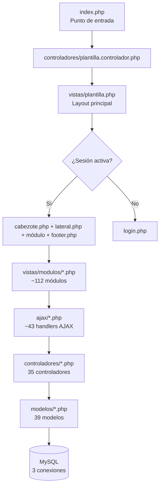
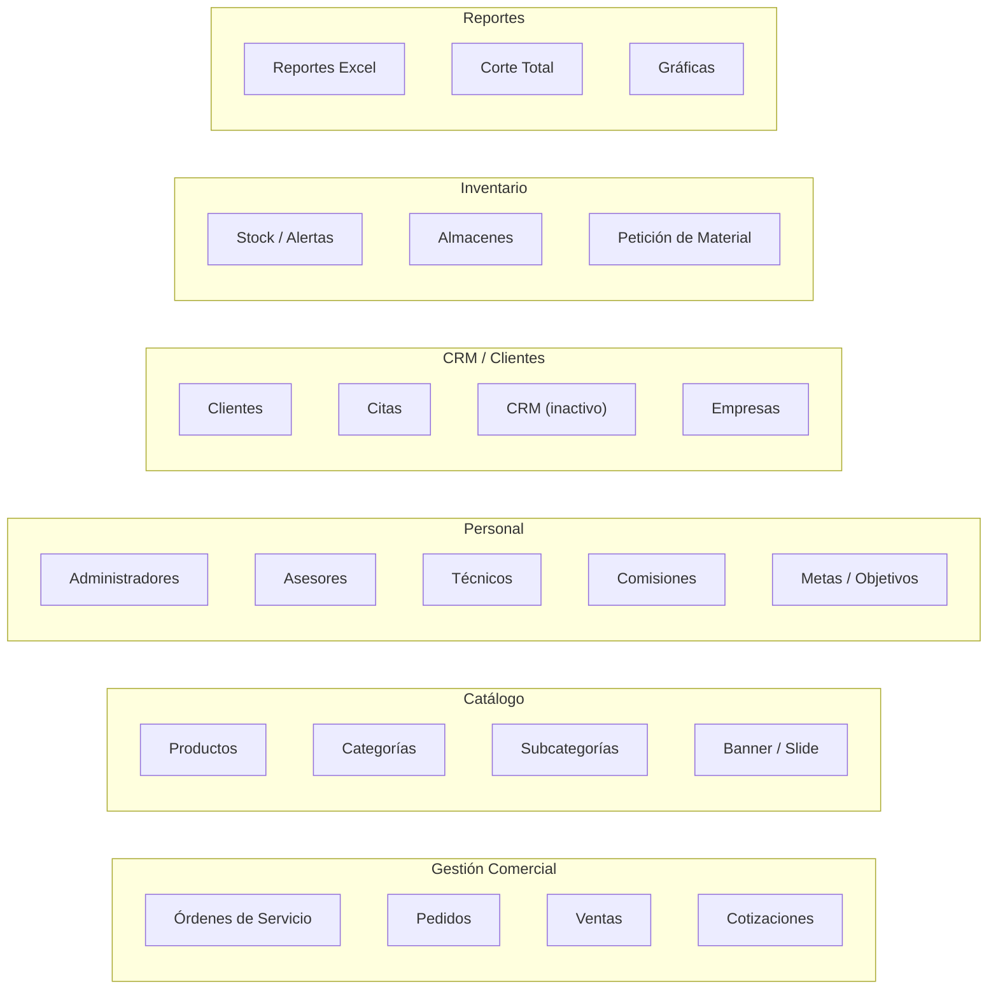

# 📋 Documentación Completa — EGS Comercializadora (Panel Backend)

## 1. Descripción General

**EGS Equipo de Cómputo** es un sistema web tipo **Panel de Administración** construido en PHP puro con un patrón **MVC artesanal**. Sirve como ERP/CRM interno para gestionar órdenes de servicio técnico, productos, ventas, pedidos, clientes, cotizaciones, técnicos, asesores, comisiones, metas y reportes.

| Concepto | Detalle |
|---|---|
| **URL producción** | `https://backend.egsequipodecomputo.com/` |
| **URL pública** | `https://egsequipodecomputo.com/` |
| **Stack** | PHP 7.1 + MySQL + AdminLTE 2 + jQuery 3.6 + DataTables |
| **Base de datos** | 3 conexiones distintas (mysqli + 2× PDO) |
| **Hosting** | cPanel (compartido) |

---

## 2. Arquitectura del Proyecto

### Estructura de directorios

| Directorio | Propósito | Archivos |
|---|---|---|
| `config/` | Configuración de BD y constantes globales | 2 |
| `controladores/` | Lógica de negocio (capa controlador) | 35 |
| `modelos/` | Consultas SQL y acceso a datos (capa modelo) | 39 |
| `vistas/modulos/` | Vistas PHP + HTML (capa vista) | ~112 |
| `vistas/js/` | JavaScript del frontend (jQuery) | 32 |
| `ajax/` | Endpoints AJAX para DataTables y formularios | 43 |
| `ServerSide/` | Procesamiento server-side de DataTables | 5 |
| `extensiones/` | Librerías de terceros (TCPDF, PHPMailer, WooCommerce) | — |
| `vistas/bower_components/` | Librerías frontend (Bootstrap 3, DataTables, etc.) | — |

### Conexiones a base de datos

El proyecto mantiene **3 conexiones separadas** a bases distintas:

| Archivo | Tipo | Base de datos | Uso principal |
|---|---|---|---|
| [config/Conexion.php](file:///c:/Users/black/Desktop/EGS/config/Conexion.php) | **mysqli** | `egsequip_dbsistema` | Tablas AJAX del sistema de ventas |
| [modelos/conexion.php](file:///c:/Users/black/Desktop/EGS/modelos/conexion.php) | **PDO** | `egsequip_ecomerce` | E-commerce / productos |
| [modelos/conexionWordpress.php](file:///c:/Users/black/Desktop/EGS/modelos/conexionWordpress.php) | **PDO** | `egsequip_respaldo` | Órdenes, pedidos, comisiones |

---

## 3. Alcance Funcional (Módulos)

### 3.1 Módulos principales

| Módulo | Archivos clave | Descripción |
|---|---|---|
| **Órdenes de servicio** | `ordenes.controlador.php` (6320 líneas), `ordenes.modelo.php` (3502 líneas) | CRUD completo de órdenes técnicas con estados, partidas, precios, multimedia, fechas de entrega |
| **Productos** | `productos.controlador.php` (2024 líneas), `productos.modelo.php` | Catálogo con categorías, subcategorías, ofertas, stock, código de barras |
| **Pedidos** | `pedidos.controlador.php` (36K), `pedidos.modelo.php` | Gestión de pedidos de clientes con estados y crédito |
| **Ventas** | `ventas.controlador.php`, `ventasR.php` (61K) | Punto de venta, historial, reportes |
| **Clientes** | `clientes.controlador.php`, `clientes.modelo.php` | Registro, historial de compras, información de contacto |
| **Cotizaciones** | `cotizacion.php` (35K), `cotizacion.modelo.php` | Generación de cotizaciones con QR y descuentos |
| **Comisiones** | `comisiones.controlador.php` | Cálculo de comisiones por quincena para técnicos/asesores |
| **Metas/Objetivos** | `metas.controlador.php`, `objetivos*.php` | Seguimiento de metas por departamento |
| **Reportes** | `reportes.controlador.php`, `reporte_helper.php` | Exportación a Excel de órdenes, ventas, comisiones |
| **Técnicos** | `tecnicos.controlador.php` | Gestión de personal técnico |
| **Asesores** | `controlador.asesore.php` | Gestión de asesores comerciales |
| **Empresas** | `empresas.controlador.php` | Multi-empresa (EGS, LOCE, Toluca, Cartuchos) |
| **CRM** | `crm.controlador.php` (comentado) | Módulo CRM planeado pero no funcional |
| **Citas** | `citas.controlador.php` | Calendario y programación de citas |
| **Almacenes** | `almacenes.controlador.php` | Gestión de almacenes de inventario |
| **Petición de material** | `peticionmaterial.controlador.php` | Solicitudes internas de material |
| **Tickets** | `tickets.controlador.php` | Sistema de tickets internos |
| **Banner/Slide** | `banner.controlador.php`, `slide.controlador.php` | Gestión de contenido visual del e-commerce |

### 3.2 Roles del sistema

- **Administrador** — Acceso total
- **Asesor (vendedor)** — Ventas, órdenes propias, pedidos
- **Técnico** — Órdenes de servicio asignadas
- **Especial** — Perfiles con permisos configurables

### 3.3 Integraciones

- **WooCommerce** — Sincronización parcial de productos (`libreriawoocommerce/`)
- **TCPDF** — Generación de PDFs para impresión de órdenes/cotizaciones
- **PHPMailer** — Envío de correos electrónicos
- **Unsplash** — Fondos dinámicos estacionales en la pantalla de login

---

## 4. Errores y Problemas Detectados

### 🔴 Críticos — Seguridad

| # | Problema | Ubicación | Impacto |
|---|---|---|---|
| 1 | **Credenciales de BD en texto plano en repositorio** | [config/global.php](file:///c:/Users/black/Desktop/EGS/config/global.php), [modelos/conexion.php](file:///c:/Users/black/Desktop/EGS/modelos/conexion.php), [modelos/conexionWordpress.php](file:///c:/Users/black/Desktop/EGS/modelos/conexionWordpress.php) | Cualquier persona con acceso al repo tiene contraseñas de producción |
| 2 | **SQL Injection** en consultas con interpolación directa de variables | `ordenes.modelo.php` L13, L88, L138, L280, L316, L446 y otros | Un atacante puede inyectar SQL arbitrario vía `$valor`, `$session_id`, `$idAsesor`, etc. |
| 3 | **Nombres de tabla/columna sin sanitizar** (`$tabla`, `$item`, `$ordenar`, `$modo`) | Múltiples modelos | Inyección SQL estructural: las variables de tabla/columna se interpolan directamente en las consultas |
| 4 | **`$_GET["ruta"]` incluido en `include_once`** sin whitelist estricta | [vistas/plantilla.php](file:///c:/Users/black/Desktop/EGS/vistas/plantilla.php) L255 | La whitelist de ~75 rutas mitiga parcialmente, pero es frágil y difícil de mantener |
| 5 | **Sin protección CSRF** en formularios | Todos los formularios POST | Un atacante puede forzar acciones (crear/editar/eliminar registros) vía peticiones cross-site |
| 6 | **Eliminación de perfiles vía GET** sin confirmación server-side | `administradores.controlador.php` L477 | Cualquier enlace malicioso puede borrar perfiles: `?idPerfil=X&fotoPerfil=Y` |
| 7 | **Password almacenada en sesión** | `administradores.controlador.php` L36 | `$_SESSION["password"]` expone el hash si se filtra la sesión |
| 8 | **`debug_log.txt` accesible públicamente** con datos de cotizaciones reales | [debug_log.txt](file:///c:/Users/black/Desktop/EGS/debug_log.txt) (721 líneas) | Exposición de datos financieros, nombres de clientes y montos de producción |
| 9 | **Salt de encriptación hardcodeado** e idéntico para todos los usuarios | `administradores.controlador.php` L18, L197, L377 | Usa `crypt()` con salt fijo `$2a$07$asxx54ahjppf45sd87a5a4dDDGsystemdev$` en vez de `password_hash()` |
| 10 | **`unlink($_GET["fotoPerfil"])`** sin validación de ruta | `administradores.controlador.php` L484 | Path traversal: puede borrar archivos arbitrarios del servidor |

### 🟠 Graves — Bugs funcionales

| # | Problema | Ubicación | Impacto |
|---|---|---|---|
| 11 | **Código muerto después de `return`** | `ordenes.modelo.php` L23-27, L49-53, L75-79 y ~20 funciones más | `$stmt->close()` y `$stmt = null` nunca se ejecutan — posible memory leak en conexiones |
| 12 | **Variable fantasma `$item`** en vez de `$itemOrdenes` | `ordenes.modelo.php` L376 | `mdlMostrarordenesEmpresayPerfil()` referencia `$item` que no existe, causará un error `Undefined variable` |
| 13 | **Bind duplicado** `:partidas` en `mdlEditarFechaSalida` | `ordenes.modelo.php` L781 y L787 | Se vincula dos veces el mismo placeholder, el segundo sobreescribe al primero |
| 14 | **`precioOcho` ligado al valor de `precio6`** | `ordenes.modelo.php` L563 | Bug lógico en `mdlIngresarOrden`: `$datos["precio6"]` en lugar de `$datos["precio8"]` |
| 15 | **`var_dump()` en producción** | `administradores.controlador.php` L373 | Muestra datos internos al usuario al editar perfiles |
| 16 | **Variable `$directorio` no definida** | `administradores.controlador.php` L307 | `mkdir($directorio)` fallará al editar perfiles sin foto previa |
| 17 | **`$datos` se define condicionalmente** pero se usa siempre | `administradores.controlador.php` L199-211 | Si el password está en la lista negra, `$datos` no se define pero `mdlIngresarPerfil` se ejecuta igualmente |
| 18 | **`session_start()` llamado dos veces** | `plantilla.controlador.php` L2 y `plantilla.php` L150 | Genera warning `session already started` |
| 19 | **`require_once` duplicado** | `index.php` L133 (`peticionmaterial.modelo.php` × 2) y L153+L156 (`vendor/autoload.php` × 2) | |
| 20 | **Parámetro `$tabla` sobreescrito** | `ordenes.controlador.php` L68-69 | `ctrMostrarHistorial($tabla, $valor)` recibe `$tabla` pero lo sobreescribe inmediatamente con `"ordenes"` |

### 🟡 Moderados — Calidad de código

| # | Problema | Detalles |
|---|---|---|
| 21 | **Archivos monolíticos gigantescos** | `ordenes.controlador.php` = 6320 líneas, `ordenes.modelo.php` = 3502, `infoOrden.php` = 101KB, `ordenes.php` = 98KB |
| 22 | **Convenciones de nomenclatura inconsistentes** | Mezcla de `camelCase`, `snake_case` y prefijos (`ctr`, `ctrl`, `mdl`, `Mdl`) |
| 23 | **Controlador con nombre diferente** | `controlador.asesore.php` vs patrón `*.controlador.php`, `modelo.asesores.php` vs `*.modelo.php` |
| 24 | **Archivos de prueba en producción** | `ordenesentornoprueba.php`, `pedidosentornodeprueba.php`, `pedidosPrueba.php` |
| 25 | **Código comentado abundante** | Múltiples `//require_once`, bloques PHP y JS completos deshabilitados |
| 26 | **HTML inválido** en `plantilla.php` | Scripts cargados ANTES de `<!DOCTYPE html>` (L1-4 antes de L5) |
| 27 | **CSS Dropzone incluido dos veces** | `plantilla.php` L69 y L72 |
| 28 | **PHP 7.1 (EOL)** | `.htaccess` configura `ea-php71`, versión sin soporte desde diciembre 2019 |
| 29 | **Nombre de BD "wordpress" para el módulo principal** | `ConexionWP` usado para órdenes/pedidos sugiere migración desde WordPress nunca completada |
| 30 | **No hay autoloading** | `index.php` carga manualmente 40+ archivos con `require_once` |

---

## 5. Puntos a Mejorar (Plan de Acción)

### 🔥 Prioridad 1 — Seguridad (Urgente)

| Mejora | Acción concreta |
|---|---|
| **Mover credenciales fuera del código** | Usar archivo `.env` + librería `vlucas/phpdotenv` y agregar `.env` a `.gitignore` |
| **Eliminar `debug_log.txt`** | Borrar del repositorio y agregar a `.gitignore`; implementar logging con Monolog |
| **Implementar `password_hash()` / `password_verify()`** | Migrar de `crypt()` con salt fijo a bcrypt nativo de PHP |
| **Parametrizar TODAS las consultas SQL** | Eliminar toda interpolación directa de variables en SQL; usar `?` o `:named` con `bindParam` |
| **Agregar tokens CSRF** | Generar token por sesión y validarlo en cada formulario POST |
| **Cambiar DELETE de GET a POST** | Eliminar perfiles/registros solo vía POST con confirmación CSRF |
| **Validar rutas de archivos** | Sanitizar `$_GET["fotoPerfil"]` antes de `unlink()`; restringir a directorio de uploads |
| **Actualizar PHP** | Migrar mínimo a PHP 8.1+ (LTS con soporte activo) |

### 🔧 Prioridad 2 — Corrección de Bugs

| Mejora | Acción concreta |
|---|---|
| **Corregir `precioOcho`** | Cambiar `$datos["precio6"]` → `$datos["precio8"]` en `ordenes.modelo.php` L563 |
| **Corregir `$item` fantasma** | Cambiar `$item` → `$itemOrdenes` en `ordenes.modelo.php` L376 |
| **Eliminar bind duplicado** | Remover el segundo `bindParam(":partidas", ...)` en L787 |
| **Eliminar `var_dump()`** | Remover L373 de `administradores.controlador.php` |
| **Unificar `session_start()`** | Llamar solo una vez, preferiblemente en `index.php` antes de todo |
| **Eliminar `require_once` duplicados** | Limpiar `index.php` L133 y L153/L156 |
| **Eliminar código muerto** | Remover statements después de `return` en todos los modelos |

### 📐 Prioridad 3 — Arquitectura y Mantenibilidad

| Mejora | Acción concreta |
|---|---|
| **Implementar autoloading** | Crear `composer.json` con `psr-4` autoloading para controladores/modelos |
| **Unificar conexiones a BD** | Consolidar las 3 conexiones en una sola clase con configuración centralizada |
| **Refactorizar archivos gigantes** | Dividir `ordenes.controlador.php` en módulos: `OrdenesListar`, `OrdenesCrear`, `OrdenesEditar`, etc. |
| **Sistema de routing dinámico** | Reemplazar la whitelist de ~75 rutas en `plantilla.php` por un router con mapa de rutas |
| **Estandarizar nomenclatura** | Definir convención única (`PascalCase` clases, `camelCase` métodos) y renombrar |
| **Eliminar archivos de prueba** | Remover `ordenesentornoprueba.php`, `pedidosPrueba.php`, etc. |
| **Eliminar código comentado** | Limpiar bloques de código deshabilitado en todos los archivos |
| **Normalizar partidas** | Reemplazar las 10 columnas `partidaUno..partidaDiez` + `precioUno..precioDiez` por una tabla relacional `orden_partidas` |

### 🎨 Prioridad 4 — Frontend y UX

| Mejora | Acción concreta |
|---|---|
| **Actualizar AdminLTE** | Migrar de AdminLTE 2 (Bootstrap 3) a AdminLTE 3+ (Bootstrap 4/5) |
| **Minificar y bundlear JS/CSS** | Usar un build tool para combinar los 32 archivos JS en uno optimizado |
| **Validar HTML** | Mover scripts después de `</head>` o al final del `<body>`; eliminar CSS duplicado |
| **Implementar loading states** | Agregar indicadores de carga en operaciones AJAX para mejor UX |
| **Responsividad completa** | Probar y corregir módulos grandes (órdenes, pedidos) en móviles |

---

## 6. Estadísticas del Proyecto

| Métrica | Valor |
|---|---|
| Total de archivos PHP (controladores) | 35 |
| Total de archivos PHP (modelos) | 39 |
| Total de archivos PHP (vistas/módulos) | ~112 |
| Total de archivos PHP (AJAX) | 43 |
| Total de archivos JS | 32 |
| Archivo más grande | `ordenes.controlador.php` — 6320 líneas / 110 KB |
| Vista más grande | `infoOrden.php` — 101 KB |
| Rutas registradas en whitelist | ~75 |
| Conexiones a BD distintas | 3 |
| Archivos con credenciales expuestas | 3 |
| Vulnerabilidades SQL Injection detectadas | 15+ funciones |
| Bugs funcionales confirmados | 10+ |

---

## 7. Diagrama de Módulos del Sistema

---

> [!CAUTION]
> **Las credenciales de producción están expuestas en 3 archivos del repositorio.** Se recomienda cambiar inmediatamente los passwords de las bases de datos y mover las credenciales a un archivo `.env` fuera del control de versiones.

> [!WARNING]
> **Se detectaron 15+ puntos de inyección SQL** donde variables se interpolan directamente en consultas. Esto constituye un riesgo crítico para la integridad de los datos de producción.
